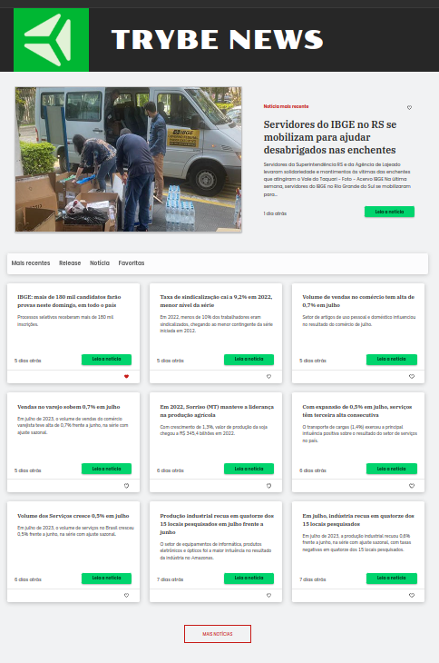

# Trybe News 🗞️

O Trybe News é um projeto desenvolvido como parte do processo seletivo para a vaga de Dev Tech Leader Super Senior na Trybe. Neste desafio, fui desafiado a criar uma aplicação responsiva em poucos dias, que se baseasse na API de notícias da IBGE.

## Deploy do Site
Você pode acessar a versão implantada do Trybe News [aqui](https://pulpor-news.vercel.app/).

 

  

 

## Tecnologias Utilizadas
O projeto foi construído com as seguintes tecnologias:

- React.js
- TypeScript
- CSS puro
- ESLint
- RTL (React Testing Library)
- Vite
- Vitest
- FontAwesome

## Responsividade
A aplicação é totalmente responsiva e se adapta a diferentes tamanhos de tela. Ela foi projetada para oferecer uma ótima experiência de usuário em dispositivos com resoluções de tela de 1024px, 768px, 568px e 350px.

## Easter Eggs
Para tornar a experiência mais divertida, foram adicionados alguns easter eggs na aplicação. No entanto, não darei spoilers aqui! Veja se você consegue encontrá-los durante a navegação, uma dica: não é console.log! 🐰🥚🎉

